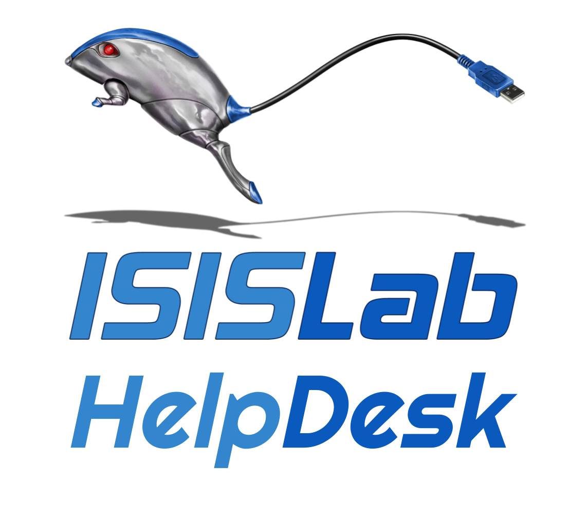
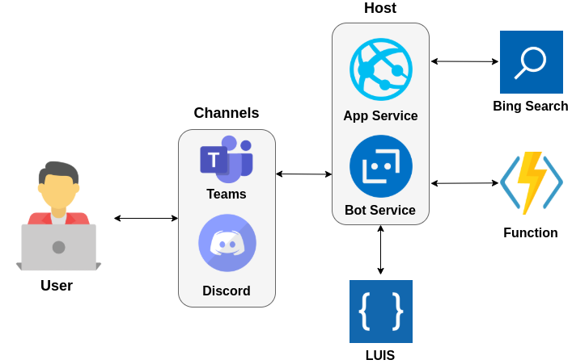

# ISISLabHelpDesk
ISISLabHelpDesk is a chat bot created for all [ISISLab](https://www.isislab.it/) members in order to support them in their activities.
ISISLabHelpDesk is based on [Azure Bot Service](https://docs.microsoft.com/en-us/azure/bot-service), a Cloud service available on [Microsoft Azure](https://azure.microsoft.com/it-it/) that provides all the required tools to build and deploy intelligent bots integrating them with all the others Azure services.

<p align="center"></p>

ISISLABHelpDesk provides the following features:

- access to useful information for new members;
- access to the laboratory's social channels;
- visualization of the next scheduled seminars;
- Sending the booking request for a seminar.

The figure below shows:

- the platforms that the user can use to interact with the chatbot;
- the services used to realize the bot and their interaction.

<p align="center"></p>

This tutorial aims to show how it is possible to take advantage of the [Microsoft Bot Framework](https://dev.botframework.com/) and other Azure services to develop a chatbot to automate some functionalities of interest.
This tutorial also shows you how to test the chatbot locally, host it on Azure, and connect it with Microsoft Teams or other applications.

#### Tutorial Structure

* **[Prerequisites](#prerequisites)**
* **[Installation](#installation)**
* **[Resources](#resources)**
* **[Execution](#execution)**

## Prerequisites
- [An Azure Subscription](https://portal.azure.com/)
- A Google Account
- Node.js
- [Azure CLI](https://docs.microsoft.com/it-it/cli/azure/install-azure-cli)
- [Bot Framework Emulator](https://github.com/Microsoft/BotFramework-Emulator/blob/master/README.md)
- [ngrok](https://ngrok.com/)

## Installation
This tutorial is designed to be runned on a Linux-based OS but it can be easily reproduced on a Windows/OS system with minor changes.
Clone the repository and install all the required packages.
```sh
$ npm install
```

## Resources
Based on [Azure Bot Service](https://docs.microsoft.com/en-us/azure/bot-service) ISISLabHelpDesk utilises some resources on Microsoft Azure to run, furthermore the available functionalities exploit several Azure services that are connected to the bot using specific credentials.
In this section a tutorial for the creation of all the required Azure resources is proposed, both the [Portal](https://portal.azure.com) and the Azure CLI will be used. In order to maintain the cost low as much as possible will be chosen the free tier when available.

**REMINDER** Every resource on Cloud needs some deployment time that in some cases can be quite long, be patient.

### Resource Group
First thing first an Azure Resource Group is required, this is pretty straightforward to do using the Azure Portal and can also be done dinamically while creating the first resource.
**ATTENTION** The selected region must be the same for all the remaining resources.

### Bot Channels Registration
[Bot Channels Registration](https://docs.microsoft.com/en-us/azure/bot-service/bot-service-quickstart-registration?view=azure-bot-service-4.0) allows to register a bot in Microsoft Azure Portal with the Azure Bot Service. 
1. Create a new resource and using the search bar find 'Bot Channels Registration'.
2. Give the bot a name, this name will be showed on Microsoft Teams, Discord, etc.
3. Provide the details for the Subscription, Resource Group (if you don't have one, here you can create a new one), and Location. 
4. Choose the 'Princing tier' F0 (Free).
5. Leave all the others fields as default and press Create.
When the resource is been correctly deployed go to resource.
1. In the lateral menu choose 'Settings'.
2. Search for the 'Microsoft App ID', copy it and save it in the file *.env* in the main folder of the project in `MicrosoftAppId` field. ***ATTENTION*** The file can be hidden, press CTRL+H to see it.
3. Click on 'Manage' next to the 'Microsoft App ID' field and click on 'New client secret' bottom.
4. Save the value field of the created key in the file _.env_ in `MicrosoftAppPassword` field.

### Language Understanding
[Language Understanding (LUIS)](https://docs.microsoft.com/en-us/azure/cognitive-services/luis/what-is-luis) is a cloud-based conversational AI service that applies custom machine-learning intelligence to text to predict overall meaning. Using LUIS applications are able to understand what a person wants analyzing inputs provided in natural language.
ISISLabHelpDesk uses LUIS to direct the user to the right functionality based on the input text.
Using the Azure Portal.
1. Create a new resource and using the search bar find 'Language Understanding'.
2. Provide the details for the Subscription, Resource Group and the name. 
3. Choose the location and the 'Princing tier' F0 (Free) for both the resources.
4. Leave all the others fields as default.

When the resource is been correctly deployed go to resource.
1. In the lateral menu choose 'Keys and endpoints' click on 'Show keys'.
2. Copy one the two keys and save it in the file _.env_ in `LuisAPIKey` field.
3. Copy the location and save it in the file _.env_ in `LuisAPIHostName` field. You should get something like `<location>.api.cognitive.microsoft.com`.
4. Based on the chosen region, go to
    * [luis.ai](https://www.luis.ai/) for US;
    * [eu.luis.ai](https://www.eu.luis.ai/) for Europe;
    * [luis.ai](https://www.au.luis.ai/) for Australia,
login with your Azure account and select the newly created Authoring resource.
5. Click on the arrow next to 'New app' and choose 'Import as JSON'. Select the file inside the serviceResources folder.
6. After the creation click on the 'Manage' tab, set the option 'Make endpoints public' on (if it is not), and copy the App ID and save it in the file _.env_ in `LuisAppId` field.
7. Click on 'Train' to train the model and then publish it selecting 'Production Slot'.

### Function App
[Azure Function App](https://docs.microsoft.com/en-us/azure/azure-functions/functions-overview) is the Serverless Computing service offered by Azure that allows to run blocks of code called function.
ISISLabHelpDesk uses a function to send the reservation email that contains all the user's input.
Using the Azure Portal.
1. Create a new resource and using the search bar find 'Function App'.
2. Provide the details for the Subscription, Resource Group and the name. 
3. Select Node.js as 'Runtime stack', choose the Region and leave the remaining fields as default.
When the resource is been correctly deployed go to resource.
1. In the lateral menu choose 'Functions' and create a new function using the button 'Add'.
2. Select the 'Template HTTP trigger' and insert a name for the function.
3. The Portal will redirect you automaticaly in the function page, click on 'Get Function URL'. copy the URL and save it in the file _.env_ in `FunctionEndpoint` field.
4. In the lateral menu of the same page choose 'Code+test', replace the code with the one inside the file sendMailFunction.js in the servicesResources folder and save.
**ATTENTION** Remember to modify the email addresses inside the code with your GMail address and the destination address (Lines 7-8 and 17-18).
5. Go to `https://<FunctionAppName>.scm.azurewebsites.net` and choose 'Debug Console' -> 'CMD'.
```sh
$ cd site/wwwroot
$ npm install nodemailer
```

### Storage Account
[Storage Account](https://docs.microsoft.com/en-us/azure/storage/common/storage-account-overview) is the Azure service that allows to store all kind of data object.
In ISISLabHelpDesk is needed to manage the upload of the required image for the seminar.
Using the Azure Portal.
1. Create a new resource and using the search bar find 'Storage account'.
2. Provide the details for the Subscription, Resource Group, the name and the Location. 
4. Leave the remaining fields as default.
When the resource is been correctly deployed go to resource.
1. In the lateral menu choose 'Access keys' and copy the value of 'Connection string' field and save it in the file _.env_ in `SAConnectionString` field.
2. Insert the Storage account name, located in the left-up corner, in the file _.env_ in `StorageAccountName` field.
3. In the lateral menu choose 'Overview' and click on 'Container', create a new container with the name 'public' and for 'Public access level' select 'Container'.

### Bing Search v7
[Bing Image Search API](https://docs.microsoft.com/en-us/bing/search-apis/bing-image-search/overview) is an API that allows to implement a smart image search inside applications providing meaningful results. 
ISISLabHelpDesk uses Bing Image Search to suggest an image to the user in order to be used for the seminar.
Using the Azure Portal.
1. Create a new resource and using the search bar find 'Bing Search v7'.
2. Provide the details for the Subscription, Resource Group, the name and select the Free tier F0 in the 'Pricing tier' field. 
3. Check the box and create.
When the resource is been correctly deployed go to resource.
1. In the lateral menu choose 'Keys and Endpoint', click on 'Show keys'
2. Copy one the two keys and save it in the file _.env_ in `BingImageSearch` field.

### Web App
[App Service Web Apps](https://docs.microsoft.com/en-us/azure/app-service/) enables to quickly build, deploy, and scale enterprise-grade web, mobile, and API apps running on any platform. 
In ISISLabHelpDesk is used as the hosting service.
Using the Azure Portal.
1. Create a new resource and using the search bar find 'Web App'.
2. Provide the details for the Subscription, Resource Group, and the name. 
3. Select Node 12 LTS as 'Runtime stack', Windows as the 'Operating System' (it does not really matter but it is more flexible), choose the Region and leave the remaining fields as default.

### Additional resource: Google API key
The Google API key is a unique identifier needed for authentication purpose.
ISISLabHelpDesk access to a public Google Calendar to retrieve the events so a Google Calendar API is needed.
1. In the [Cloud Console](https://console.developers.google.com/), on the [project selector page](https://console.cloud.google.com/projectselector2/home/dashboard?_ga=2.230502236.1548499487.1607075519-698306279.1605005292), select or create a Google Cloud project for which you want to add an API Key.
2. Go to the 'APIs & Services' -> '[Credentials page](https://console.cloud.google.com/apis/credentials)'.
3. On the Credentials page, click 'Create credentials' -> 'API key'. The API key created dialog displays your newly created API key.
4. Copy the key value and save it in the file _.env_ in `GoogleAPIKey` field.
5. In the [Cloud Console](https://console.developers.google.com/), go to the 'Dashboard' -> 'Enable APIs and services', search for Google Calendar API and enable it.

## Execution
A bot developed with Azure Bot Service can be hosted both on Cloud using Web App service and in local using [Bot Framework Emulator](https://github.com/Microsoft/BotFramework-Emulator/blob/master/README.md) and [ngrok](https://ngrok.com/). The bot will work in the same way but is clearly better to run the bot in a local environment while testing. If you want to execute ISISLabHelpDesk on Microsoft Teams or on others kind of applications the Cloud Hosting is needed.

***ATTENTION*** All the aforementioned resources are nevertheless necessary to ensure proper operation of ISISLabHelpDesk. The only difference is that in local environment Web App service is not used for hosting so it is not required.

### Local hosting
#### Testing the bot with Bot Framework Emulator
1. Start ngrok
```sh
$ ./ngrok http -host-header=rewrite 3978
```
2. Open a terminal in ISISLabHelpDesk folder and start the bot
```sh
$ npm start
```
3. Start Bot Framework Emulator and select 'Open Bot'.
4. Provide the needed fields
    * Bot URL: `http://localhost:3978/api/messages`
    * Microsoft App ID: present within the file _.env_.
    * Microsoft App password: present within the file _.env_.

#### Testing the bot from Azure Portal
1. Start ngrok 
```sh
$ ./ngrok http -host-header=rewrite 3978
```
2. Open a terminal in ISISLabHelpDesk folder and start the bot
```sh
$ npm start
```
3. Go to the Bot Channels Registration resource using the Azure Portal:
    * In the lateral menu choose 'Channels' and insert as 'Messaging endpoint' the URL showed in terminal by ngrok followed by 'api/messages/". You should get something like `https://1aa1a1234567.ngrok.io/api/messages`.
    * Click on 'Save'.
    * In the lateral menu choose 'Test in Web Chat', the bot will start and be ready to test. All the logs will be available in the system terminal.

### Cloud hosting
#### Deploy the project on Web App
1. Zip up the code directory manually. Make sure that you are in the bot's project folder, the one that contains index.js file. Select **ALL** the files and folders before running the command to create the zip file, make sure to include also the _.env_ file that can be hidden, in this case use CTRL+H to show it. If your root folder location is incorrect, the bot will fail to run in the Azure portal.
2. Open terminal inside the folder
```sh
$ az webapp deployment source config-zip --resource-group "<resource-group-name>" --name "<name-of-web-app>" --src "<project-zip-path>"
```
3. Wait for the deploy, it might take a while.

#### Set the bot to use the Web App
Go to the Bot Channels Registration resource using the Azure Portal.
1. In the lateral menu choose 'Settings' and insert as 'Messaging endpoint' the URL of the Web App resource followed by 'api/messages/'. You should get something like `https://<nomeWebApp>.azurewebsites.net/api/messages`.
2. Click on 'Save'.
Now the bot can be tested using the Web Chat available on Azure Portal goin in the in the lateral menu of the Bot Channels Registration resource and choosing 'Test in Web Chat', the bot will start and be ready to test.

#### [Deploy on Microsoft Teams](https://docs.microsoft.com/en-us/azure/bot-service/channel-connect-teams?view=azure-bot-service-4.0)
Go to the Bot Channels Registration resource using the Azure Portal.
1. In the lateral menu choose 'Channels'.
2. Select the Microsoft Teams icon in 'Add a feature channel' section to create a new channels for Microsoft Teams.
3. Close the created channel and return in 'Channels' page. Click on 'Microsoft Teams', that will open a conversation with the bot inside Microsoft Teams app.
**The might take a while to be ready**

**Authors**
ISISLab - Università degli Studi di Salerno
- Vittorio Scarano
- Carmine Spagnuolo
- Matteo D'Auria
- Giuseppe D'Ambrosio
